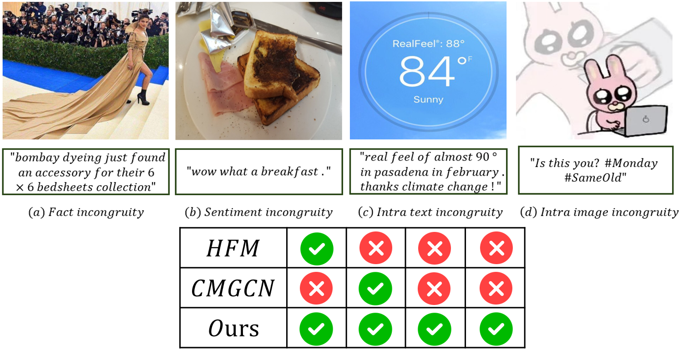

# 🎉 Welcome to the Official Repo for "Complete Multi-Modal Metric Learning for Multi-Modal Sarcasm Detection"! 

Thanks for stopping by! This is where you'll find the code implementation for our paper *Complete Multi-Modal Metric Learning for Multi-Modal Sarcasm Detection*. We’re keeping it brief for now, but once the paper is published, we'll be rolling out a detailed guide with more goodies! Stay tuned. 📚

## 🎯 Why "Complete Incongruity" Matters  

Multi-modal sarcasm detection is a process to capture **complete incongruity**. Let’s break it down! 🕵️‍♀️  

### 🖼️ Examples That Speak Volumes  
Here are four multi-modal sarcasm samples that showcase the complexity of incongruity. We also list the inference results of our model and some representative models on these samples.



1. **[Sample a]** *(Fact incongruity)*  
   - **Reason**: In the text, the image of a woman wearing a floor-length dress is described as "Bombay Dyeing just found an accessory for their 6×6 bedsheets collection." Although the text does not explicitly mention the dress, it metaphorically compares it to a bedsheet. This implicit fact incongruity satirizes the impracticality and excessive extravagance of the woman's attire.  

2. **[Sample b]** *(Sentiment incongruity)*  
   - **Reason**: The image shows a burnt piece of bread,  which naturally evokes dissatisfaction. In contrast, the text enthusiastically states, "Wow, what a breakfast." This sentiment incongruity highlights the sarcasm of the stark contrast between the quality of the breakfast and the exaggerated expectation. 

3. **[Sample c]** *(Intra-modal text incongruity)*  
   - **Reason**: The image displays a weather forecast with "RealFeel: 88°, Now: 84°, Sunny," which is congruous with the text’s statement, "real feel of almost 90° in Pasadena in February." However, the incongruity arises within the text itself: the first sentence conveys dissatisfaction with the unusually high temperature in February, while the second sarcastically states, "thanks climate change." This sentimental reversal highlights the sarcasm of the global warming phenomenon. 

4. **[Sample d]** *(Intra-modal image incongruity)*  
   - **Reason**: The text "#Monday #SameOld" provides contextual background for the image, while "Is this you?" encourages viewers to reflect on the scene. The text complements the image, establishing congruity between the modalities. However, the incongruity within the image arises from the anthropomorphic rabbit appearing to work diligently on a computer while internally imagining smashing it. This contrast satirizes the conflict in modern work environments between outward composure and suppressed frustration.

Our efficient model excels at identifying **complete incongruity**, encompassing both **inter-modal** and **intra-modal** incongruities across **fact** and **sentiment** perspectives—areas where traditional models often falter.

## 🚀 Installation Instructions
Let’s get you up and running! Here’s what you need to do:

1. **Download the data**  
   Grab the dataset from ["Multi-Modal Sarcasm Detection in Twitter with Hierarchical Fusion Model"](https://github.com/ZLJ2015106/pytorch-multimodal_sarcasm_detection.git) (it’s a great starting point).

2. **Install the required packages**  
   Before diving into the code, make sure you have the following installed:
   ```bash
   torch == 1.13.0
   torchtext == 0.14.0
   torchvision == 0.14.0
   clip == 1.0
   senticnet == 1.6
   ```
   *Pro Tip*: The object existence vector from yolo v10 is packed inside the `text_data` for you.

## 🛠️ Usage

Once you’ve got everything ready, running the code is as easy as:

```bash
python main.py
```

## 📦 Download the Pre-trained Parameters

The parameter file will be available soon, hosted on Google Drive. Please hold tight while we get things sorted out! 🙏 [wait..]


